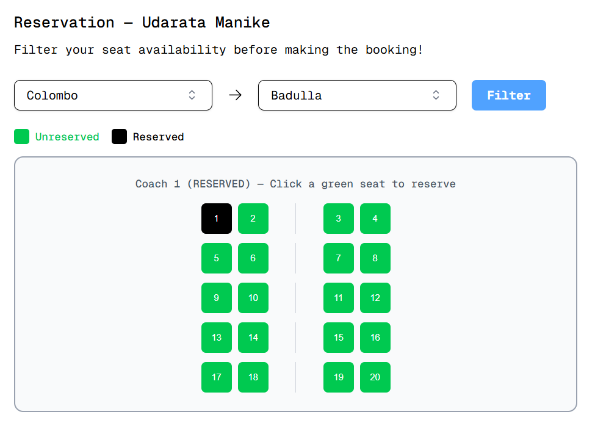
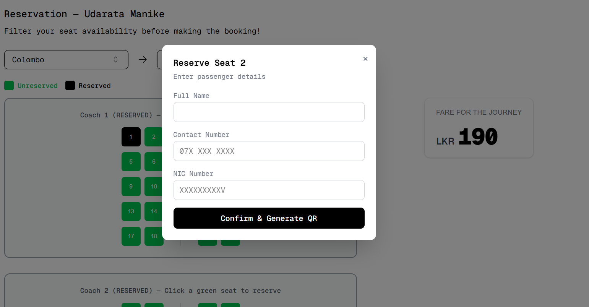
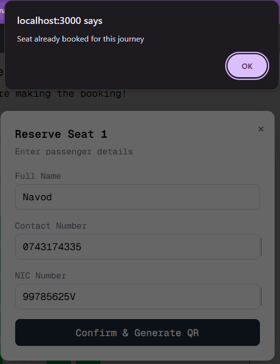

# Train Booking Service

A client-server (monolith) train reservation system built with Spring Boot and Next.js. Users can browse departures, filter seat availability for a specific leg of a journey, and reserve seats. Admins get a full CRUD dashboard to manage trains, coaches, seats, stations, departures, fares, and revenue.

## Tech Stack

- **Backend:** Java, Spring Boot
- **Frontend:** Next.js
- **Database:** PostgreSQL (containerized)
- **Containerization:** Docker / Docker Compose

## Getting Started

### Prerequisites

- Docker and Docker Compose installed

### Run the project

1. Clone the repo
   ```bash
   git clone <repo-url>
   cd <repo-folder>
   ```
2. Build the containers
   ```bash
   docker compose build
   ```
3. Start the project
   ```bash
   docker compose up
   ```

## Architecture

This project is a typical client-server monolith. After weighing the project requirements which are essentially implementing a booking service and a microservices approach was considered over-engineering for the scope, so a monolithic architecture was chosen instead.


## Database
- A containerized PostgreSQL database is used.
- Database had to be a relational database due to the structured nature of the data stored in this scenario. Postgres was chosen for its compatibility with Springboot and docker.
- Mutual exclusion of the seat booking process is enforced at the database level using `btree_gist`. Considered application level mutual exclusion as well but discovered it to be not as secure. `btree_gist` was then used to simulate a pessimistic exclusion.   
- On every booking insert, a database trigger updates a `journey_range` column with the order IDs of the stations the seat will be occupied for.
- When a user filters seat availability for a leg of a journey, the backend checks this field for overlapping stations to determine whether the request passes or fails.
- Race conditions are handled at the database level: only one user can successfully reserve a given seat at a time, and conflicting requests fail with a notification to the user.

## Backend
- Springboot was chosen for the backend due to its easy maintainabilty and support for transactions. Also considered Node.js and FastAPI but ultimately deemed not suitable to develop maintainable large applications as the code can get messy easily and does not possess an out of the box support for transactions. 
- The backend was developed with separate models, repositories, controllers, services, and DTOs to handle frontend requests and database communication.
- Table creation is **not** handled by JPA on startup, it's handled by the `init.sql` file in the database folder.
- The backend does **not** implement authentication or authorization, as this was outside the project requirements.

## Frontend
- Next.js was chosen over React.js for the frontend because of the App router, built-in server components and fetch functions. 
- The frontend is built with a landing page, a user tab, and an admin tab.
- Since there's no authorization layer, the user and admin frontends were not separated and are implemented in the same frontend.
- **User tab:** view scheduled departures, select one, check seat availability for a specific leg of the journey, and make a reservation.
- **Admin tab:** exposes CRUD operations to manage Trains (with Coaches and Seats), Stations, Departures, Fares, and Revenue details. Changes here are reflected immediately in the user tab.
- Some UI components were styled with AI assistance.
- State management is **not** implemented. 

## Extra Credit Features

### 1. Seat Map Visualization

For a given train, coaches and seats are rendered as an interactive seat map. Unreserved seats are shown in green and reserved seats in black; reserved seats can't be interacted with. Users can filter by origin/destination before viewing availability.



> Note: seats carry a `type` property (window vs. non-window), but this distinction is not yet surfaced in the UI and the business logic, all seats currently appear identical to the user.

Selecting an available seat opens a modal to collect passenger details (full name, contact number, NIC number) before confirming the reservation.




**Booking flow:**
1. User selects a seat and submits passenger details.
2. Backend commits the booking to the database.
3. Backend generates a JWT signed with the backend secret key, containing the booking details, with an expiration set to 1 hour after the departure time.
4. The token is sent to the frontend, which uses it to generate a QR code.
5. The user can screenshot/save the QR code to verify their reservation at the station counter.

> Note: station counter QR verification is not implemented in this application.

### 2. Admin View

A dedicated admin tab lets department staff add or delete trains, departures, fares, and stations, as well as view generated revenue.

### 3. Clearer Handling of Booking Conflicts in the UI

Users filter by journey endpoints and immediately see which seats are reserved (black) vs. unreserved (green). Reserved seats are non-interactive. If a user attempts to book a seat that's just been taken (e.g. a race condition), they receive a clear error message: *"Seat already booked for this journey."*



### 4. Fare Logic

Fare calculation is straightforward:

```
Total_fare = base_fare + fare_per_segment * no_of_segments
```
## Challenges
 
### Seat type integration
 
Initially, the plan was to implement proper seat type support so users could specifically choose a window or non-window seat. This ran into issues during the seat initiation process: an admin can currently specify the number of coaches and seats when creating a train, but introducing seat types would have required reworking that process with significantly more design complexity. Since the requirements didn't call for seat type selection, it was dropped to stay within the time constraint.
 
### Containerization of DB-exclusive changes
 
Certain exclusion principles, like `btree_gist`, were implemented at the database level, and the containerization process didn't account for them out of the box. The booking table creation had to be migrated into an `init.sql` script, which then clashed with JPA's own initialization. The fix was to move the entire table migration process into `init.sql`, leaving JPA to only validate the schema rather than create it.

